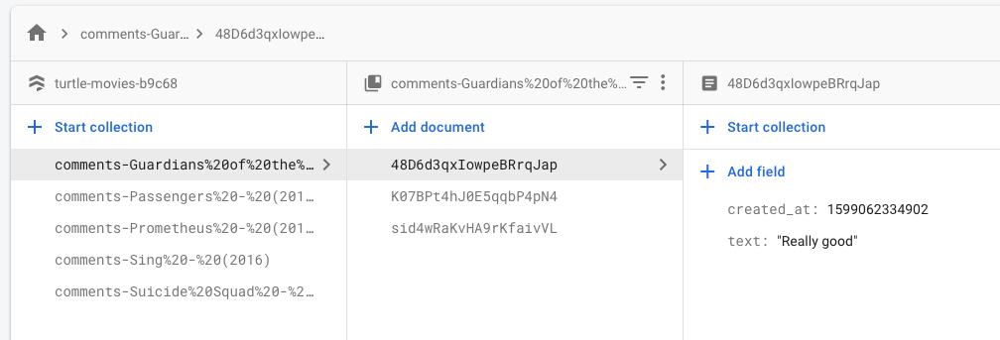

# How to run the code

Make sure to have `expo-cli`, get more information [here](https://docs.expo.io/get-started/installation/).

1. `npm install -g expo-cli`
2. `npm install` or `yarn`
3. `npm run ios` or `yarn ios`

## Architecture

I tried to keep as simple and readable as possible. 

The app uses `apollo` for fetching and managing network data together with `graphql-tools` to simulate a graphQL server on the client. You can check `ApolloProvider` component on the source code.

For the Comments Screen I'm using Firestore from Firebase together with `typesaurus` to make the code easier and cleaner to work with Typescript.

Firestore database is using `title` + `year` as an ID. The database looks like this:

## What would you like to improve?

1. Give it a proper design 💅
2. Persist the network data on AsyncStorage using `apollo-cache-persist`
3. Give more user feedback for `loading, empty state, error and network-error`
4. Add pagination on comments to be ready to scale up the app 🚀 
5. Add tools to track user behaviour and crashes
6. Hide firebase keys 😂